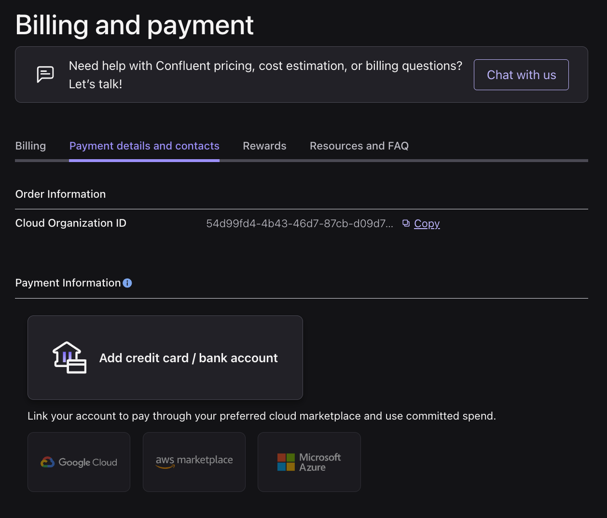
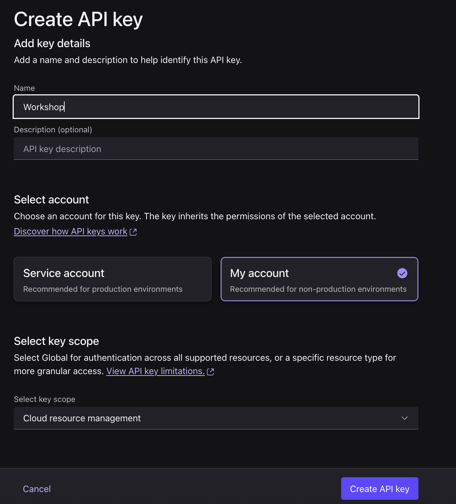

# 🛠️ Self-Service Workshop — Build the Streaming Agent by Hand

In this workshop you deploy the Confluent Cloud infrastructure with Terraform, then build the
**real-time fraud detection AI pipeline yourself** — running each Flink SQL statement in the
Confluent Cloud UI: the model, the function tools, the agent, the windowing, and the detection
query. Terraform creates the cluster, the Bedrock connection, the tools JAR, and the 4 tables
(so the producer can start immediately); **you create everything else**.

> The one-command auto-deployed version is the [Demo path](DEMO.md). This workshop is the
> hands-on version.

**Time:** ~1 hour of hands-on work — *if* the prerequisites below are done in advance.

## 0. Before you arrive (prerequisites — do these ahead of time)

These are **not** part of the timed hour. Complete them before the workshop:

- [ ] **Confluent Cloud account, a payment method, and a Cloud API key & secret** — the three
      steps in [0.1](#01-set-up-confluent-cloud) below.
- [ ] **AWS account with an IAM user** that has a long-lived access key & secret and the
      `bedrock:InvokeModel` permission.
- [ ] **Claude model access enabled in Amazon Bedrock**, region **`us-east-1`** — enable
      Anthropic Claude on the **Model access** page. Approval can lag, so do this early;
      without it, `AI_RUN_AGENT` fails with AccessDenied and no alerts appear.
- [ ] **Tools installed:** [Terraform](https://github.com/hashicorp/terraform),
      [Git](https://git-scm.com/), [Python 3.11+](https://www.python.org/downloads/).

### 0.1 Set up Confluent Cloud

#### Step 1 — Create your Confluent Cloud account

1. Go to **[confluent.io/get-started](https://www.confluent.io/get-started/?product=cloud)**
   (or **[confluent.cloud/signup](https://confluent.cloud/signup)**).
2. Enter your **name**, **work email**, **company**, and a **password**, then accept the terms
   and click **Start Free**.
3. On first sign-in, an **onboarding wizard** asks a few questions, then offers to create your
   first cluster.

> [!WARNING]
> **Do NOT create a cluster.** Skip the **Add cluster** / **Create cluster** step — Terraform
> creates its own environment *and* cluster for you. Click the Confluent logo (top-left) to
> exit the wizard.

#### Step 2 — Add a payment method (credit card)

A card is required for Terraform to create a **Standard** cluster. Free credit is used first, so
you typically won't be charged during the workshop.

> [!TIP]
> All new sign-ups get **$400 in free credit** to use within the first 30 days — deploying this
> workshop will not get you charged.

1. Go directly to **[Billing & payment](https://confluent.cloud/settings/billing/payment)**.
2. Open the **Payment details and contacts** tab.
3. Click **Add credit card / bank account**.



4. Enter your **card details**, then **Save**.

#### Step 3 — Create a Cloud API key & secret

Terraform authenticates with an **org-level "Cloud resource management" API key**. This is what
you'll paste into `workshop.tfvars`.

1. Go directly to **[API keys](https://confluent.cloud/settings/api-keys)** and click **+ Add API key**.
2. On the **Create API key** form: enter a **Name** (e.g. `Workshop`), select **My account**, and
   set **Select key scope** to **Cloud resource management**.



> [!NOTE]
> A service account works too, but then you must grant it the OrganizationAdmin role
> separately — "My account" already has your permissions.

3. Click **Create API key**, then **copy the Key and Secret** (the secret is shown **only once**,
   or click **Download**). These are your `confluent_cloud_api_key` and `confluent_cloud_api_secret`
   in `workshop.tfvars`.

## 1. Deploy the infrastructure (~8–12 min)

1. Clone the repo and enter the `terraform` directory:

   ```bash
   git clone https://github.com/confluentinc/demo-confluent-fraud-agent.git
   cd demo-confluent-fraud-agent/terraform
   ```

2. Create your vars file from the template:

   ```bash
   cp workshop.tfvars.example workshop.tfvars
   ```

3. Edit **`workshop.tfvars`** and fill in your 4 credentials (`deploy_flink_pipeline` is already
   set to `false`).

4. Deploy:

   ```bash
   terraform init && terraform apply -var-file=workshop.tfvars
   ```

This provisions the environment, Kafka cluster, Schema Registry, Flink compute pool, the
Bedrock connection, the tools JAR artifact, and the **4 tables** — but **not** the AI
pipeline. It also writes a ready-to-use `.env` for the producer and dashboard.

When it finishes, note these outputs (you'll paste them into the SQL below):

```bash
terraform output tools_artifact_id   # -> paste into the CREATE FUNCTION statements
terraform output flink_catalog       # -> the workspace Catalog to select
terraform output flink_database      # -> the workspace Database to select
```

## 2. Open the Flink workspace and set your context

Open the [Flink workspace](https://confluent.cloud/go/flink). Set the **Catalog** to your
`flink_catalog` value and the **Database** to your `flink_database` value. All the statements
below use unqualified names, so this context must be set first.

## 3. Build the pipeline — run these statements in order (~15–25 min)

Run each statement below in the workspace, one at a time, waiting for each to finish before
the next. Statements 3.1–3.8 are DDL and reach **COMPLETED** in a few seconds; statements 3.9
and 3.10 are continuous and go **RUNNING**.

### 3.1 Register the model

Wires up the Bedrock Claude model behind a callable name.

```sql
CREATE MODEL `fraud_model`
INPUT (`prompt` STRING)
OUTPUT (`response` STRING)
WITH (
  'provider' = 'bedrock',
  'task' = 'text_generation',
  'bedrock.connection' = 'bedrock-fraud-connection',
  'bedrock.params.max_tokens' = '8192'
);
```

### 3.2–3.4 Create the three function tools

These map the pre-uploaded UDF JAR classes to Flink functions. **Replace
`<TOOLS_ARTIFACT_ID>` in all three with your `tools_artifact_id` output.**

```sql
CREATE FUNCTION `flag_transaction`
AS 'io.confluent.frauddemo.FlagTransaction'
USING JAR 'confluent-artifact://<TOOLS_ARTIFACT_ID>';
```

```sql
CREATE FUNCTION `freeze_account`
AS 'io.confluent.frauddemo.FreezeAccount'
USING JAR 'confluent-artifact://<TOOLS_ARTIFACT_ID>';
```

```sql
CREATE FUNCTION `notify_user`
AS 'io.confluent.frauddemo.NotifyUser'
USING JAR 'confluent-artifact://<TOOLS_ARTIFACT_ID>';
```

### 3.5–3.7 Wrap the functions as agent tools

Tools give the agent a name + description it can reason about when deciding to act.

```sql
CREATE TOOL `flag_transaction_tool`
USING FUNCTION `flag_transaction`
WITH (
  'type' = 'function',
  'description' = 'Flag a specific transaction as potentially fraudulent for manual review. Arguments: transaction_id, reason.'
);
```

```sql
CREATE TOOL `freeze_account_tool`
USING FUNCTION `freeze_account`
WITH (
  'type' = 'function',
  'description' = 'Temporarily freeze a user account due to suspected fraud. Arguments: user_id, reason.'
);
```

```sql
CREATE TOOL `notify_user_tool`
USING FUNCTION `notify_user`
WITH (
  'type' = 'function',
  'description' = 'Send a fraud alert notification to the user. Arguments: user_id, message.'
);
```

### 3.8 Create the agent

The agent binds the model + the three tools + a hardened prompt that scores each profile and
decides which tools to call.

```sql
CREATE AGENT `fraud_detection_agent`
USING MODEL `fraud_model`
USING PROMPT 'You are a real-time fraud detection analyst.

You receive a plain-text activity profile for ONE user over a short time window. It lists
the user id and that user''s recent transactions (each shown as "txn <transaction_id>: $<amount> at <merchant> ..."),
recent logins (location, device, ip), and recent account changes (field, old value, new value).

Analyze for these fraud signals:
1. Geographic impossibility: login and transaction in distant cities within minutes
2. Velocity anomalies: many transactions in a short period
3. Account takeover: email/password change followed by a large purchase
4. Unusual amounts: transactions much larger than others
5. Device/IP anomalies: new devices combined with other signals

SCORING GUIDE - use the FULL range:
- 90-100: Multiple strong signals combined (e.g. geo-impossible + account takeover + large amount)
- 70-89: One strong signal with supporting evidence (e.g. geo-impossible travel alone)
- 45-69: Suspicious patterns that need investigation (e.g. unusual amount or velocity alone)
- 20-44: Mildly unusual but likely legitimate (e.g. new device from same city)
- 0-19: Normal activity, no fraud signals detected

TOOLS - DECIDE THE SCORE FIRST, THEN ACT. Determine risk_score before calling any tool, and
only call the tools the score warrants below. Make every tool call up front. Once you call a
tool, treat it as final: never reconsider it, apologize for it, or reverse it in text.
- If risk_score >= 80: call freeze_account_tool(user_id, reason) and notify_user_tool(user_id, message)
- If risk_score 50-79: call flag_transaction_tool(transaction_id, reason) for each suspicious transaction and notify_user_tool(user_id, message)
- If risk_score 20-49: call notify_user_tool(user_id, message)
- If risk_score < 20: do NOT call any tool.
Record the tools you actually called in "actions_taken".

CRITICAL RULES:
- Copy the EXACT "user_id" string from the input. Do NOT change it.
- Copy EXACT "transaction_id" strings from the input into "flagged_transaction_ids". Do NOT invent IDs.
- If no transactions exist, set "flagged_transaction_ids" to an empty list.
- Your FINAL message must be ONLY the single JSON object below: no preamble, no commentary, no
  self-corrections, no markdown, no code fences. Put all explanation inside "reasoning", nowhere else.
{"user_id": "<copy from input>", "risk_score": <0-100 integer>, "reasoning": "<one or two sentences>", "actions_taken": ["freeze_account"|"flag_transaction"|"notify_user"], "flagged_transaction_ids": ["<copied transaction ids>"]}'
USING TOOLS `flag_transaction_tool`, `freeze_account_tool`, `notify_user_tool`
WITH (
  'max_iterations' = '6',
  'handle_exception' = 'continue',
  'max_consecutive_failures' = '5'
);
```

### 3.9 Build the activity profiles (windowing)

> [!IMPORTANT]
> **Run the `SET` first, in the same workspace session, before the `CREATE TABLE`.** It pins
> the watermark idle-timeout to 5s. Without it, Confluent Cloud's default "progressive
> idleness" grows the idle timeout as the statement ages and the session windows stall — you'd
> see an early burst of alerts that then dries up. (In the demo path this is set automatically
> as a statement property on the windowing job.)

```sql
SET 'sql.tables.scan.idle-timeout' = '5 s';
```

This unions the three input streams and collects each user's activity into a 3-second
event-time SESSION window — one profile per activity burst. It is materialized as its own
`activity_profiles` table so you can query it and see it in Stream Lineage.

```sql
CREATE TABLE `activity_profiles` AS
WITH `unified` AS (
  SELECT `user_id`, 'transaction' AS `event_type`, `event_time`,
         CONCAT('- txn ', `transaction_id`, ': $', CAST(`amount` AS STRING),
                ' at ', `merchant`, ' (', `merchant_category`, ') in ', `location`) AS `line`
  FROM `transactions`
  UNION ALL
  SELECT `user_id`, 'login' AS `event_type`, `event_time`,
         CONCAT('- login from ', `location`, ' via ', `device_id`, ' (ip ', `ip_address`, ')') AS `line`
  FROM `user_logins`
  UNION ALL
  SELECT `user_id`, 'account_change' AS `event_type`, `event_time`,
         CONCAT('- ', `field_changed`, ' changed from "', `old_value`, '" to "', `new_value`, '"') AS `line`
  FROM `account_changes`
)
SELECT
  `user_id`,
  `window_start`,
  `window_end`,
  CONCAT(
    'User: ', `user_id`, '\n\n',
    'Transactions:\n', COALESCE(LISTAGG(CASE WHEN `event_type` = 'transaction' THEN `line` END, '\n'), '  (none)'), '\n\n',
    'Logins:\n', COALESCE(LISTAGG(CASE WHEN `event_type` = 'login' THEN `line` END, '\n'), '  (none)'), '\n\n',
    'Account changes:\n', COALESCE(LISTAGG(CASE WHEN `event_type` = 'account_change' THEN `line` END, '\n'), '  (none)')
  ) AS `profile_text`
FROM TABLE(
  SESSION(TABLE `unified` PARTITION BY `user_id`, DESCRIPTOR(`event_time`), INTERVAL '3' SECONDS)
)
GROUP BY `user_id`, `window_start`, `window_end`;
```

### 3.10 Run the detection query

Runs the agent over each profile and parses its JSON verdict into the `fraud_alerts` table.
This is the statement that actually calls Bedrock — it stays **RUNNING**.

```sql
INSERT INTO `fraud_alerts`
WITH `scored` AS (
  SELECT
    `user_id`,
    CAST(`response` AS STRING) AS `raw_response`,
    REGEXP_EXTRACT(CAST(`response` AS STRING), '\{[\s\S]*\}', 0) AS `json_text`
  FROM `activity_profiles`,
  LATERAL TABLE(AI_RUN_AGENT(`fraud_detection_agent`, `profile_text`, `user_id`))
)
SELECT
  `user_id`,
  COALESCE(CAST(JSON_VALUE(`json_text`, '$.risk_score') AS INT), 0) AS `risk_score`,
  COALESCE(JSON_VALUE(`json_text`, '$.reasoning'), '') AS `reasoning`,
  COALESCE(JSON_QUERY(`json_text`, '$.actions_taken'), '[]') AS `actions_taken`,
  COALESCE(JSON_QUERY(`json_text`, '$.flagged_transaction_ids'), '[]') AS `flagged_transaction_ids`,
  `raw_response`
FROM `scored`;
```

## 4. Run the producer and dashboard (~8–12 min)

From the repo root, in two terminals (activate the venv in each):

```bash
python3 -m venv venv && source venv/bin/activate && pip install -r requirements.txt
python producer/generate_events.py          # terminal 1
streamlit run dashboard/app.py              # terminal 2 -> http://localhost:8501
```

The producer and dashboard use the `.env` Terraform already wrote. The dashboard reads from
`latest`, so keep the producer running and allow ~1–2 minutes for the first window-firing
batch of alerts.

You can also watch the two stages directly in the workspace:

```sql
SELECT * FROM activity_profiles;                     -- one row per user per session window
SELECT * FROM fraud_alerts WHERE risk_score >= 70;   -- the high-risk verdicts
```

## 5. Cleanup

```bash
cd terraform && terraform destroy -var-file=workshop.tfvars
```
